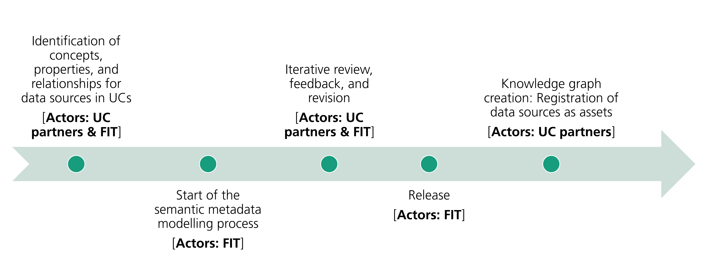
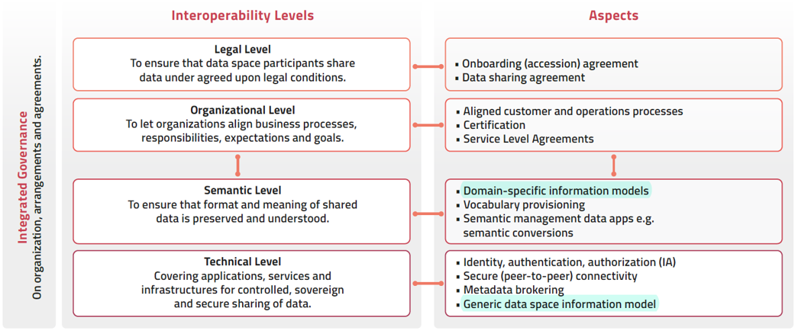
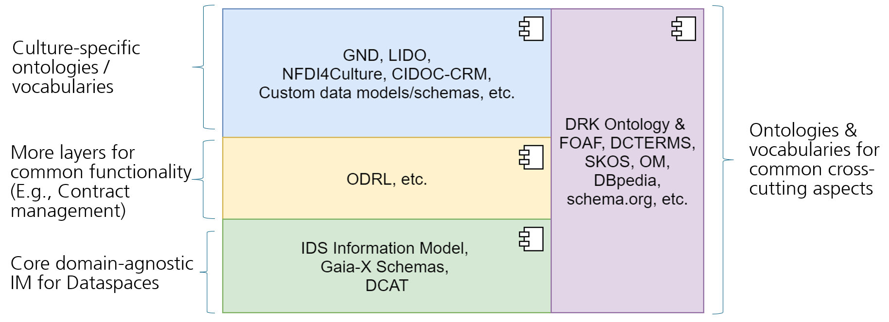

## 🆔 Primary Identifiers

  
  
  
  

  
  

# Culture Information Model (Culture IM / DRK IM)
**Culture Information Model (Culture IM) / Datenraum Kultur Information Model (DRK IM)**: The DRK IM is a Semantic Information Model that aims to define formal specifications of concepts, relationships, and constraints (application profiles) within the culture dataspace. This formalization provides a structured framework for understanding and organizing information within the DRK project. In addition, this forms a basis for representing information in DRK in the form of a Knowledge Graph (DRK KG) with more advanced querying, inference, and reasoning capabilities.

# Culture/DRK IM Contents
- The Culture (DRK) Ontology
  - Common modules for organizations, places and accessibility, creative works, events, roles, and data services.
  - Culture sector (subdomain) specific modules for performing arts theater showtimes, museums and collections, and music marketplaces
- Extensible semantic schemas (metadata templates) and their visual models (in the form of editable UML class diagrams)
- Application profiles (constraints: mandatory, recommended, optional - in the form of SHACL shapes)
  - General Application Profiles (GAP) for general use case with a convention-based set of recommended concepts and attributes and common, minimum constraints foreseen to be applicable to all specific applications that will be drived from it.
  - Specific Application Profiles (SAP) for specific use case scenarios with concrete data providers and their data sources, derived from  GAPs.
- Controlled vocabularies for representing enumerations
- Templates for access and usage policies (in the form of ODRL policy templates/examples)
- Competency questions for scoping and validating the information model and modeling discussions (in the form of Issues and comments)
- Example instances and queries (in the form of SPARQL queries based on competency questions)
- Documentation (currently, in the form of README files)

## 🔍 Quick Access

- **📖 [Browse Ontology](https://fraunhofer-fit-dsai.github.io/drk-information-model/)**
- **⚡ [SPARQL Query Endpoint](https://github.com/Fraunhofer-FIT-DSAI/drk-information-model/tree/main/sparql-endpoint)** - Query the DRK Knowledge Graph
- **🎯 [Example Queries](https://github.com/Fraunhofer-FIT-DSAI/drk-information-model/blob/main/sparql-endpoint/README.md)** - Pre-built queries to get started
- **📋 [Download Ontology](drk-ontology.ttl)** - RDF/Turtle format
- **📐 [Visual Models](https://github.com/Fraunhofer-FIT-DSAI/drk-information-model/tree/main/visual-models)** - UML diagrams and visual representations

---

# Culture (DRK) Ontology Documentation
[WIDOCO-generated Documentation](https://fraunhofer-fit-dsai.github.io/drk-information-model/)

# Naming Conventions
- **Directories and files**: All small letters, separated by hyphens (-). Example: `drk-ontology.ttl`
- **Prefixes**: In DRK Ontology, we use https://prefix.cc/ to abbreviate URIs
- **Versioning**: DRK IM release snapshots will follow the [Semantic Versioning Specification 2.0.0](https://semver.org/spec/v2.0.0.html) (SemVer - Major.Minor.Patch)

# AP-first (Application Profile-first) Methodology for developing the Culture IM (DRK IM)

## Goals
- This code repository aims to enable collaboration among domain experts (Use Case (UC) partners) and Semantic Web experts (FIT DRK IM Group) to develop the DRK IM.
- Here, we aim to create extensible semantic schemas (metadata templates) and application profiles (constraints: mandatory, recommended, and optional) for data sources from the DRK use cases.

## Prerequisites
- Documentation of your data sources (APIs, Datasets) to be connected to the DRK infrastructure in this document: [Template Datennehmer-geber und Nutzungsvereinbarungen v1.1.xslx](https://acatechev.sharepoint.de/:x:/r/sites/DRKulturUseCasesTest/_layouts/15/doc2.aspx?sourcedoc=%7B675D2413-1C4F-4DF3-B64B-D1823BD7DDB8%7D&file=Template%20Datennehmer-geber%20und%20Nutzungsvereinbarungen%20v1.1.xlsx&action=default&mobileredirect=true) (This is an internal resource specific to the DRK project. Alternatively, you can use the following template to directly input this information in a new Github issue).
- Template: To get started with semantic modelling, we generally need the following information:
---
**Use case scenario and data source details**:
- Use Case scenario description: 
- [DRK project specific info] Relevant UCs: (UC1, UC2, UC3, UC4)
- Stakeholder: Data Provider: 
- Data Source Type (API / Dataset): 
- Data Source Name: 
- Data Source Short Description: 
- URLs to Interfaces (GUI, API, Download Link):  
- Data Format (JSON, JSON-LD, CSV, etc.): 
- URL to API specification OR API/Dataset Documentation: 
- URL to Data Model Documentation: Documentation that provides detailed information about the data fields a model contains, its structure, and any referred ontologies, vocabularies, or standard data models. Such documentation is often expressed using UML Class Diagrams or Entity Relationship (ER) Diagrams. For example, see the [LinkSmart Service Catalog Data Model Documentation](https://github.com/linksmart/service-catalog/wiki/API-Documentation)
- Examples of data payload / dataset records: 
- License / Data Access Policy: 
- Data Usage Policies: 
> Ideally, the Data Access/Usage Policies for this data source should be discussed in a separate issue, and it should be linked to this main issue.
- Stakeholder: (Potential) Data Consumer(s): 
- Expected Queries / Competency Questions (provided by (potential) data consumers): 

**Example use case scenario**:
> An example workflow that illustrates the data source, the potential data consumers and data flow.
---

## Main Process Steps

1. **Identification of concepts, properties, and relationships**
- **Actors**: UC partners (domain experts), with support from FIT DRK IM Group (Semantic Web experts).
- For one or more data sources, a **new GitHub issue** should be created (preferably by a UC partner). This issue should specify the new concepts, properties, and/or application profiles (constraints) that need to be added to the DRK Information Model (IM) based on the data model of the data source(s).
- **Preferable formats**: A graph, a JSON Schema as a part of OpenAPI spec, a UML Class Diagrams or an Entity Relationship (ER) Diagram that specifies the concepts, properties, and their interrelationships. A link to Miro, Mural, draw.io, or lucidchart board is also welcome. Where possible, the UC partner suggests existing ontologies or vocabularies where these concepts are defined. Even semantic descriptions in TTL/TRIG/JSON-LD format can be entered.

> **Creation of meaningful identifiers for culture domain specific entities**: 
> While instantiating the culture domain specific entities such as Theaters, Events, Plays, we would need to assign them with identifiers.
> It would be desirable to use identifiers that are machine-readable as well as human-readable and understandable.
> Such a naming scheme can be developed in this issue: https://github.com/Fraunhofer-FIT-DSAI/drk-information-model/issues/2

2. **Start of the semantic metadata modelling process**
- **Actors**: FIT DRK IM Group.
- The DRK IM group identifies **ontologies and vocabularies** for semantically representing these concepts and creates (visual) semantic metadata representations, preferably based on the ontologies identified in the DRK IM layers diagram (see below).

3. **Iterative review, feedback, and revision**
- **Actors**: UC partners and FIT DRK IM Group.
- The semantic metadata representations and application profiles (constraints) are discussed and updated in an iterative manner.
- Once final, the DRK IM group creates **formal semantic descriptions (RDF) and constraints (SHACL shapes)** and merges them as a pull request with the DRK IM repository’s `main` branch.

4. **Release**
- **Actors**: FIT DRK IM Group.
- The DRK IM release snapshots will follow the SemVer versioning specification.

5. **Knowledge graph creation: Registration of data sources as assets**
- **Actors**: UC partners, with support from FIT DRK IM Group, if required.
- As a part of registration of data sources as assets, the semantic metadata schemas and application profiles from the DRK IM are used to create metadata instances.
- This registration of data sources happens through EDC’s user interface or API.
- This forms the DRK Knowledge Graph (DRK KG).

# More Information

### DRK IM in the Context of the European Interoperability Framework (EIF)

DRK IM focuses on the interoperability aspects within the Technical and Semantic Levels of the EIF, particularly the use of generic and domain-specific information models, together with tooling support to enable interoperability in the data space for culture.

(Image sources: [iSHARE Cookbook for Data Spaces](https://ishare.eu/wp-content/uploads/2023/09/iShare-Data-Spaces-Kookboek_UK-v1.pdf), [EIF]( https://joinup.ec.europa.eu/collection/nifo-national-interoperability-framework-observatory/european-interoperability-framework-detail))

### Existing Data Models Collection for Reuse - Culture/DRK IM Layers (Work in progress)

To facilitate both the modular representation and FAIRness (Findability, Accessibility, Interoperability, and Reusability) of information, the DRK IM is structured into layers, as illustrated in the following figure. These layers are realized using the existing ontologies and vocabularies.

(Graphic: Rohit Deshmukh, Daham Mohammed Mustafa/Fraunhofer FIT)

# Glossary

Digital Asset (subset: "Data Asset")
- A digital resource or offering, owned by an organisation that it intends to share to generate revenue or in the public interest (data altruism).
- Examples: Datasets, APIs, tools (SaaP), documents, files, web pages, etc.

Data Asset
- A data resource or offering, owned by an organisation that it intends to share to generate revenue or in the public interest (data altruism).
- Data Asset is a subset of Digital Asset. 
- Examples: Data API: Theater Showtimes API, Dataset: Museum Collection Dataset, File/Document: An art exhibition flyer in PDF format.
- In the Datenraum Kultur (DRK) project, we are mostly working with (Data) Assets / Data Sources in the form of datasets and APIs. An asset is described using metadata that enables its discovery.

Metadata 
- Metadata is data that provides information about other data.
- It includes details such as the origin, context, content, structure, and accessibility information associated with the data, helping to facilitate understanding, discovery, and retrieval.
- Example: For a book, metadata might include details such as ISBN, title, author(s), description, publication date, publisher, genre, language, etc.
- In the Datenraum Kultur (DRK) project, metadata for an asset includes information such as its name, description, URL at which the asset can be accessed, provider organization, URL to documentation, access and usage policies, culture domain specific information based on the nature of the asset, etc.

Content data
- Content data refers to the actual data provided by an asset.
- In a dataspace, Content data is exchanged directly between participants in a peer-to-peer manner.
- A data consumer discovers an asset by using its metadata and then invokes the URL from its metadata to retrieve the asset's content data.
- In the context of HTTP-based data APIs, content data is often referred to as "data payload" or "response body".

Data model
- A data model is a structured representation of data that defines data elements (fields/classes), their properties, interrelationships and constraints.
- A schema is a more concrete representation of a data model.
- Data models are often represented using UML Class Diagrams or Entity Relationship (ER) Diagrams. For a more concrete representation, a JSON Schema as a part of an OpenAPI spec is often used.
- Example: [Data model of LinkSmart Service Catalog](https://github.com/linksmart/service-catalog/wiki/API-Documentation) (a service registry for Web Services) represented using a UML Class Diagram. Its OpenAPI specification [Swagger UI](https://linksmart.eu/swagger-ui/dist/?url=https://raw.githubusercontent.com/linksmart/service-catalog/master/apidoc/swagger.json#/) [JSON](https://raw.githubusercontent.com/linksmart/service-catalog/master/apidoc/swagger.json) captures its schema. On [Swagger UI](https://linksmart.eu/swagger-ui/dist/?url=https://raw.githubusercontent.com/linksmart/service-catalog/master/apidoc/swagger.json#/) page, see the "Service" schema under "Schemas".

# FAQs
1. What is the purpose of the DRK IM (Datenraum Kultur Information Model)?
- The DRK Information Model is a semantic data model that defines formal concepts, relationships, and constraints for cultural data within the DRK (culture dataspace).
- It ensures that metadata describing cultural assets is represented in a structured, consistent, and semantically rich way, thereby enabling providers to provide high-quality metadata and (potential) consumers to discover the assets/offerings using advanced multi-parameter queries.
 
2. Who defines the classes and relationships within the DRK IM, and what assumptions guide this process?
- Classes and relationships in the DRK Information Model are collaboratively defined by domain experts (UC partners) and Semantic Web experts (FIT DRK IM Group).
- This is based on the idea that semantic consistency and real-world applicability can only be achieved through iterative and collaborative work between these two parties, and that this work must be grounded in actual data and real-world use cases.
 
3. What is the scope of the DRK IM, and how far shall it be extended?
- The current scope includes modeling metadata for theaters (especially, showtimes or play schedules), museums & collections, and music marketplaces, based on the DRK use cases, with the objective of making the models "work" within the framework of dataspaces. 
- Any future extensions should be based on concrete use cases, real-world data sources, and availability of domain expertise.
